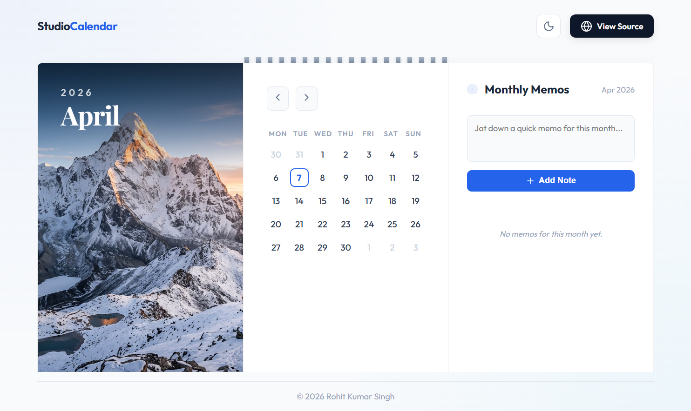

# 🗓️ Studio Calendar | Elite Designer Series

[](https://nextjs.org/)
[](https://reactjs.org/)
[](https://vercel.com/)
[](LICENSE)

### [Live Preview](https://github.com/Rohitkr2002/Frontend-Engineering-Challenge) &middot; [Report Bug](https://github.com/Rohitkr2002/Frontend-Engineering-Challenge/issues)

---



---

## 🎨 Design Philosophy

The **Studio Calendar** is not just a scheduling tool; it's a piece of "digital furniture." Inspired by high-end boutique stationary and professional designer studios, it focuses on **bespoke aesthetics** over standard UI components.

### Core Pillars
- **Physical Frame Logic**: The UI is wrapped in a "binder" frame with realistic rings, giving it a tactile, physical presence.
- **Precision Typography**: Utilizing *Outfit* for modern data and *Playfair Display* for a classic, sophisticated header feel.
- **Glassmorphism**: Subtle translucency on the sidebar and overlays to maintain an airy, premium atmosphere.
- **Contextual Memos**: Instead of just dates, we treat time as a canvas for "Monthly Memos."

---

## 🚀 Key Features

- **🏆 Studio Aesthetic**: Viewport-locked, physical frame interface for a "premium app" feel.
- **📅 Interactive Range Selection**: Choose start and end dates with fluid Framer Motion animations.
- **🌗 Boutique Dark Mode**: A carefully curated dark palette that preserves the designer's intent.
- **📱 Fully Responsive**: Custom media queries ensure the "Studio" experience persists on Mobile & Tablet.
- **📝 Smart Sidebar**: Automatically updates notes based on your selected date range.

---

## 🏗️ Project Structure

```bash
├── src/
│   ├── app/                # Next.js App Router (Layouts & Pages)
│   ├── components/
│   │   ├── Calendar/       # Core calendar logic & grid
│   │   ├── Notes/          # Contextual sidebar component
│   │   └── UI/             # Shared "Physical Frame" wrapper
│   └── styles/             # Global themes & design tokens
├── public/                 # Optimized assets & Hero images
└── next.config.ts          # Optimized Dev/Prod configuration
```

---

## 🛠️ Performance & Optimization

- **Turbo-ready**: Built using Next.js 14+ with Turbopack for lightning-fast development.
- **Zero-Boilerplate**: All default Next.js assets were removed to keep the bundle size extremely tight.
- **SEO Optimized**: Advanced metadata for professional portfolio presentation.

---

## 👨‍💻 Author

**Rohit Kumar Singh**
*Frontend Engineer & Aspiring Data Analyst*

---

> This project was developed as a submission for the **Frontend Engineering Challenge**, focusing on UI/UX excellence and technical stability.
